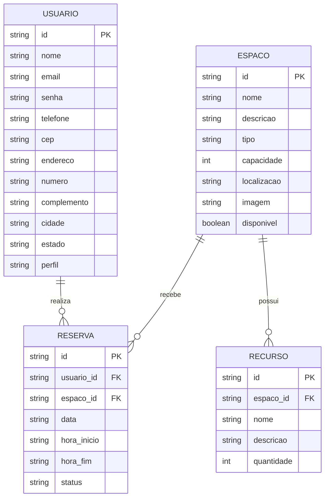

# Architecture — Workspace Hub

## 1. Visão Geral

O Workspace Hub será desenvolvido como uma aplicação web para consulta, gerenciamento e reserva de espaços de trabalho compartilhados.

A aplicação será estruturada de forma modular, separando os arquivos de interface, estilos, scripts e documentação.

Durante o desenvolvimento da disciplina, a aplicação utilizará tecnologias front-end e APIs para simular o armazenamento e o acesso aos dados.

---

## 2. Arquitetura Inicial

A aplicação será organizada em três partes principais:

### Interface

Responsável pela apresentação das páginas e componentes da aplicação.

Tecnologias previstas:

- HTML5
- CSS3
- Bootstrap
- Sass/SCSS

### Lógica da aplicação

Responsável pela interação com o usuário, validação dos formulários, manipulação do DOM e comunicação com APIs.

Tecnologias previstas:

- JavaScript
- jQuery
- jQuery Mask Plugin

### Dados e APIs

Responsável pelo armazenamento e consulta dos dados da aplicação.

Tecnologias previstas:

- JSON Server
- API pública ViaCEP
- Web Storage

---

## 3. Modelo de Dados

O sistema será composto inicialmente pelas seguintes entidades:

- Usuário
- Espaço
- Reserva
- Recurso

### Diagrama Entidade-Relacionamento

